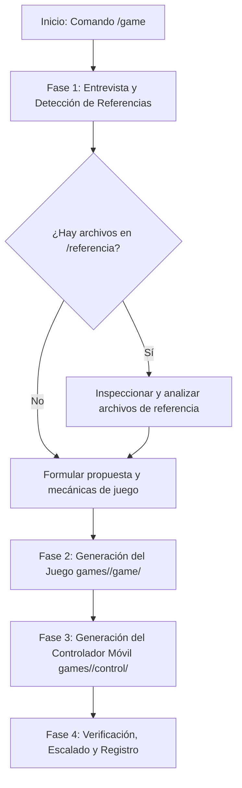

# Agente Creador de Juegos Retro Arcade (MyPlayAd)

Este agente se especializa en la creación integral de nuevos minijuegos retro interactivos para la plataforma **MyPlayAd**. Todos los juegos siguen estrictamente la arquitectura, paleta de colores, diseño CRT/arcade y protocolo de comunicación WebRTC bidireccional entre la pantalla y el control móvil, tomando como estándar de referencia [`games/arkanoid/game`](file:///Users/gonza/mycodes/myPlayAd/games/arkanoid/game) y [`games/arkanoid/control`](file:///Users/gonza/mycodes/myPlayAd/games/arkanoid/control).

---

## 🛠️ Flujo de Trabajo del Agente (`/game`)



---

## 📋 Fase 1: Entrevista y Detección de Referencias

Al activarse con `/game`, el agente debe interactuar con el usuario para definir los requisitos del nuevo juego:

1. **Mensaje de Bienvenida y Solicitud de Requisitos**:
   * Preguntar por el concepto del juego: temática, objetivo, mecánicas principales, controles deseados en el móvil (ej. joystick virtual, trackpad, d-pad, botones de acción, swipes, inclinación), sistema de vidas y puntuación.
   * **Instrucción Obligatoria al Usuario**:
     > *"Si tienes algún archivo, código base, spritesheet, imagen, documento o proyecto de referencia, puedes colocarlo en la carpeta `referencia/` en la raíz del proyecto y lo revisaré para trabajar sobre él."*

2. **Inspección de la Carpeta de Referencias**:
   * Revisar si existen archivos dentro de [`referencia/`](file:///Users/gonza/mycodes/myPlayAd/referencia) mediante herramientas de lectura. Si hay imágenes, esquemas o código, analizarlos e incorporarlos en el diseño.

---

## 🏗️ Fase 2: Estructura de Archivos Estándar

Cada nuevo juego debe crearse dentro del directorio `games/<slug>/` con la siguiente estructura idéntica a Arkanoid:

```text
games/<slug>/
├── game/                      # Aplicación que se ejecuta en la Pantalla (TV / Kiosco)
│   ├── index.html             # Estructura de consola LCD retro + video de fondo
│   ├── style.css              # Estilos CRT retro, paleta phosphor y contenedor responsivo
│   ├── script.js              # Lógica del juego, render en Canvas, WebRTC Host y autoScale
│   ├── config.js              # Configuración de señalización, TURN y endpoints
│   ├── video_loop.js          # Manejo de cola de videos de anuncios y próximos juegos
│   └── videos.html            # Vista auxiliar de reproducción de video
└── control/                   # Aplicación web que abre el jugador en su teléfono móvil
    ├── index.html             # Interfaz móvil táctil (Nickname -> Joystick/Botones -> Gracias)
    ├── style.css              # Estilos retro táctiles para móviles (touch-friendly)
    ├── script.js              # WebRTC Controller, captura de gestos/toques y envío en tiempo real
    └── config.js              # Configuración de señalización WebSockets y TURN
```

---

## 🎨 Fase 3: Estándares Visuales y de Estilo

Todos los juegos deben compartir la misma estética arcade retro CRT:

### Paleta de Colores CSS (`style.css`):
```css
:root {
    --bg-deep: #0a0f0d;         /* Fondo ultra oscuro */
    --panel: #101a15;           /* Fondo de paneles */
    --panel-edge: #1f3327;      /* Bordes de consolas */
    --phosphor: #3dff8a;        /* Verde fósforo neón principal */
    --phosphor-dim: #1f7d49;    /* Verde fósforo atenuado */
    --amber: #ffb703;           /* Acento ámbar / advertencias */
    --danger: #ff4d6d;          /* Rojo peligro / Game Over */
    --text-dim: #7fae94;        /* Texto secundario */
    --white: #eafff2;           /* Blanco verdoso neón */
}
```

### Tipografías Google Fonts:
* `'Press Start 2P', monospace;` (Títulos, marcadores, vidas, botones arcade).
* `'VT323', monospace;` (Textos de estado, ranking, tablas de puntuación).

### Reglas Críticas de Escalado y Renderizado:
1. **Media Query Responsive**:
   ```css
   @media (orientation: landscape) {
       .container {
           flex-direction: row;
       }
   }
   ```
2. **Pixel-Art Nítido en Canvas**:
   ```css
   #gameCanvas {
       background-color: transparent;
       display: block;
       image-rendering: pixelated;
       image-rendering: crisp-edges;
   }
   ```
3. **Motor Reactivo `autoScale()` en `game/script.js`**:
   ```javascript
   function autoScale() {
       const container = document.querySelector('.container');
       if (!container) return;
       container.style.transform = 'none';
       const rect = container.getBoundingClientRect();
       if (!rect.width || !rect.height) return;

       const availableW = window.innerWidth || document.documentElement.clientWidth;
       const availableH = window.innerHeight || document.documentElement.clientHeight;
       if (!availableW || !availableH) return;

       const padding = 20;
       const scaleX = (availableW - padding) / rect.width;
       const scaleY = (availableH - padding) / rect.height;
       const scale = Math.max(0.1, Math.min(scaleX, scaleY));
       container.style.transform = `scale(${scale})`;
   }

   window.addEventListener('resize', autoScale);
   window.addEventListener('load', autoScale);
   if (document.fonts && document.fonts.ready) document.fonts.ready.then(autoScale);
   if (window.ResizeObserver) new ResizeObserver(() => autoScale()).observe(document.body);
   window.addEventListener('message', (e) => { if (e.data?.type === 'RESCALE') autoScale(); });
   [0, 50, 150, 300, 600, 1200].forEach(d => setTimeout(autoScale, d));
   ```

---

## 📡 Fase 4: Protocolo de Comunicación WebRTC y Señalización

### 1. Pantalla (`game/script.js` - Host):
1. Genera un código de sala aleatorio de 4 caracteres: `GameState.roomId = Math.random().toString(36).substring(2, 6).toUpperCase()`.
2. Conecta al WebSocket de señalización (`wss://signaling.myplayad.com` o local):
   ```javascript
   socket.send(JSON.stringify({
       type: 'register',
       role: 'host',
       roomId: GameState.roomId,
       maxPlayers: CONFIG.MAX_PLAYERS || 1
   }));
   ```
3. Genera el código QR dinámico apuntando al controlador móvil:
   ```javascript
   const controlUrl = `https://controllers.myplayad.com/<slug>?room=${GameState.roomId}`;
   qrCodeImg.src = `https://api.qrserver.com/v1/create-qr-code/?size=150x150&data=${encodeURIComponent(controlUrl)}&margin=10`;
   ```
4. Recibe ofertas WebRTC (`offer`), responde con `answer`, intercambia `ice-candidates` y crea el `RTCDataChannel`.
5. Escucha eventos desde el móvil:
   * `{ type: 'join', nickname: '...' }` -> Inicia la partida.
   * `{ type: 'input', action: 'MOVE', x: ..., y: ... }` -> Movimiento analógico / digital.
   * `{ type: 'action', action: 'BUTTON_A' }` -> Disparo, salto o acción principal.
6. Al finalizar la partida (`endGame`):
   * Notifica al móvil `{ type: 'game_over', score: ... }`.
   * Envía la puntuación al ranking local/portal vía `submitScore(nickname, score)`.
   * Muestra el overlay de Hall of Fame durante 15 segundos y regenera el QR automáticamente.

### 2. Controlador Móvil (`control/script.js` - Controller):
1. Lee el `?room=XXXX` de la URL.
2. Pide el Nickname al usuario y conecta al WebSocket:
   ```javascript
   socket.send(JSON.stringify({ type: 'register', role: 'controller', roomId: roomId }));
   ```
3. Establece la conexión P2P WebRTC con la pantalla y abre el `dataChannel`.
4. Captura toques táctiles con `touchAction: none` y envía eventos con frecuencia de ~60fps (16ms throttle).
5. Proporciona vibración táctil háptica (`navigator.vibrate(20)`).
6. Al recibir `game_over`, oculta los controles y muestra la pantalla de agradecimiento.

---

## 🧪 Fase 5: Verificación y Pruebas
1. Verificar que no haya errores de sintaxis en `game/script.js` y `control/script.js`.
2. Probar que los estilos sean responsivos tanto en formato horizontal (16:9) como vertical (9:16).
3. Asegurar que las rutas de video (`video_loop.js`) funcionen sin romper si no hay conexión a internet (modo fallback offline).
