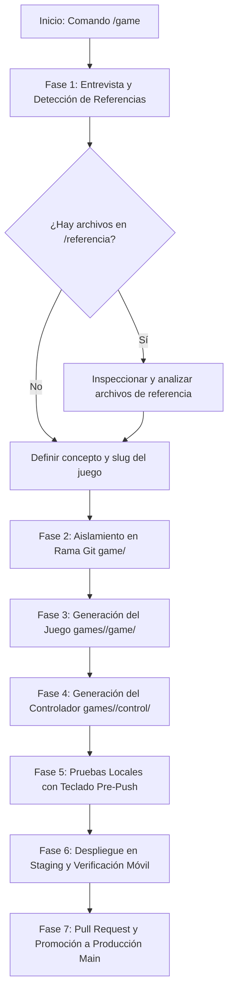

# Agente Creador de Juegos Retro Arcade (MyPlayAd)

Este agente se especializa en la creación integral de nuevos minijuegos retro interactivos para la plataforma **MyPlayAd**. Todos los juegos siguen estrictamente la arquitectura, paleta de colores, diseño CRT/arcade y protocolo de comunicación WebRTC bidireccional entre la pantalla y el control móvil, tomando como estándar de referencia [`games/arkanoid/game`](file:///Users/gonza/mycodes/myPlayAd/games/arkanoid/game) y [`games/arkanoid/control`](file:///Users/gonza/mycodes/myPlayAd/games/arkanoid/control).

---

## 🛠️ Flujo de Trabajo del Agente (`/game`)



---

## 📋 Fase 1: Entrevista y Detección de Referencias

Al activarse con `/game`, el agente debe interactuar con el usuario para definir los requisitos del nuevo juego:

1. **Mensaje de Bienvenida y Solicitud de Requisitos**:
   * Preguntar por el concepto del juego: temática, objetivo, mecánicas principales, controles deseados en el móvil (ej. joystick virtual, trackpad, d-pad, botones de acción, swipes, inclinación), sistema de vidas y puntuación.
   * **Instrucción Obligatoria al Usuario**:
     > *"Si tienes algún archivo, código base, spritesheet, imagen, documento o proyecto de referencia, puedes colocarlo en la carpeta `referencia/` en la raíz del proyecto y lo revisaré para trabajar sobre él."*

2. **Inspección de la Carpeta de Referencias**:
   * Revisar si existen archivos dentro de [`referencia/`](file:///Users/gonza/mycodes/myPlayAd/referencia) mediante herramientas de lectura. Si hay imágenes, esquemas o código, analizarlos e incorporarlos en el diseño.

---

## 🌿 Fase 2: Aislamiento Obligatorio en Rama Git (`game/<slug>`)

> [!CAUTION]
> **PROHIBIDO desarrollar o commitear juegos directamente en `main`.**
> Commitear en `main` dispara el despliegue automático a producción (`/var/www/myplayad/`).
> Todo nuevo juego o cambio debe desarrollarse en su rama aislada `game/<slug>`.

**Acción Obligatoria antes de crear archivos**:
El agente debe ejecutar el script de inicialización de rama o crearlo con Git:
```bash
# Usar el script del skill:
./.agents/skills/game/scripts/start-game-branch.sh <slug>

# O directamente:
git checkout main && git pull origin main
git checkout -b game/<slug>
```
Comprobar siempre con `git branch --show-current` que la rama activa empiece con `game/`.

---

## 🏗️ Fase 3: Estructura de Archivos Estándar

Cada nuevo juego debe crearse dentro del directorio `games/<slug>/` con la siguiente estructura idéntica a Arkanoid:

```text
games/<slug>/
├── game.json                  # Metadatos del juego (nombre, slug, icon, genre, description, controls)
├── game/                      # Aplicación que se ejecuta en la Pantalla (TV / Kiosco en modo Arcade Puro)
│   ├── index.html             # Estructura de consola LCD retro + QR local + Hall of Fame
│   ├── style.css              # Estilos CRT retro, paleta phosphor, consola 440x400 y canvas 400x320
│   ├── script.js              # Lógica del juego, render en Canvas, WebRTC Host, QR local y autoScale
│   ├── qrcode.min.js          # Generador QR local y offline (0ms latencia, sin bloqueos de red)
│   └── config.js              # Configuración de señalización, TURN y endpoints
└── control/                   # Aplicación web que abre el jugador en su teléfono móvil
    ├── index.html             # Interfaz móvil táctil (Nickname -> Joystick/Botones -> Gracias)
    ├── style.css              # Estilos retro táctiles para móviles (touch-friendly)
    ├── script.js              # WebRTC Controller, captura de gestos/toques y envío en tiempo real
    └── config.js              # Configuración de señalización WebSockets y TURN
```

---

## 🎨 Fase 4: Estándares Visuales y de Estilo

Todos los juegos deben compartir la misma estética arcade retro CRT:

### Paleta de Colores CSS (`style.css`):
```css
:root {
    --bg-deep: #0a0f0d;         /* Fondo ultra oscuro */
    --panel: #101a15;           /* Fondo de paneles */
    --panel-edge: #1f3327;      /* Bordes de consolas */
    --phosphor: #3dff8a;        /* Verde fósforo neón principal */
    --phosphor-dim: #1f7d49;    /* Verde fósforo atenuado */
    --amber: #ffb703;           /* Acento ámbar / advertencias */
    --danger: #ff4d6d;          /* Rojo peligro / Game Over */
    --text-dim: #7fae94;        /* Texto secundario */
    --white: #eafff2;           /* Blanco verdoso neón */
}
```

### Tipografías Google Fonts:
* `'Press Start 2P', monospace;` (Títulos, marcadores, vidas, botones arcade).
* `'VT323', monospace;` (Textos de estado, ranking, tablas de puntuación).

### Reglas Críticas de Escalado y Renderizado:
1. **Consola Arcade Pura y Centrada**:
   ```css
   .container {
       display: flex;
       align-items: center;
       justify-content: center;
       padding: 10px;
       transform-origin: center center;
   }
   .lcd-screen {
       width: 440px;
       height: 400px;
       min-height: 400px;
   }
   #qrcode, #qr-code-img {
       width: 160px;
       height: 160px;
       display: block;
       margin: 0 auto;
   }
   ```
2. **Pixel-Art Nítido en Canvas a Escala Entera 2x (400x320)**:
   ```css
   #gameCanvas {
       background-color: transparent;
       display: block;
       image-rendering: pixelated;
       image-rendering: crisp-edges;
       width: 400px;
       height: 320px;
   }
   ```
3. **Motor Reactivo `autoScale()` en `game/script.js`**:
   ```javascript
   function autoScale() {
       const container = document.querySelector('.container');
       if (!container) return;

       container.style.transform = 'none';
       const naturalW = container.offsetWidth || 480;
       const naturalH = container.offsetHeight || 470;

       const availableW = window.innerWidth || document.documentElement.clientWidth;
       const availableH = window.innerHeight || document.documentElement.clientHeight;
       if (!availableW || !availableH) return;

       const padding = 20;
       const scaleX = (availableW - padding) / naturalW;
       const scaleY = (availableH - padding) / naturalH;
       const scale = Math.max(0.1, Math.min(scaleX, scaleY));

       container.style.transform = `scale(${scale})`;
   }

   window.addEventListener('DOMContentLoaded', () => { updateQrCode(); autoScale(); });
   window.addEventListener('resize', autoScale);
   window.addEventListener('load', () => { updateQrCode(); autoScale(); });
   if (document.fonts && document.fonts.ready) document.fonts.ready.then(autoScale);
   if (window.ResizeObserver) new ResizeObserver(() => autoScale()).observe(document.body);
   window.addEventListener('message', (e) => { if (e.data?.type === 'RESCALE') autoScale(); });
   [0, 50, 150, 300, 600, 1200].forEach(d => setTimeout(autoScale, d));
   ```

---

## 📡 Fase 5: Protocolo de Comunicación WebRTC y Señalización

### ⚠️ Regla de Oro de Señalización (`server/server.js`):
El servidor de señalización WebSockets enruta respuestas del Host al Controller buscando **`data.playerId`**. Si el Host responde con `to: data.from` o no incluye `playerId`, el mensaje se descarta y el teléfono jamás conectará.

### 1. Pantalla (`game/script.js` - Host):
1. **Generación de Sala y Registro**:
   ```javascript
   GameState.roomId = Math.random().toString(36).substring(2, 6).toUpperCase();
   socket.send(JSON.stringify({
       type: 'register',
       role: 'host',
       roomId: GameState.roomId,
       maxPlayers: CONFIG.MAX_PLAYERS || 1
   }));
   ```
2. **Detección Dinámica de URL para QR (`config.js`)**:
   ```javascript
   const isDevHost = typeof window !== 'undefined' && (
       window.location.hostname.includes('dev') || 
       window.location.hostname.includes('staging') || 
       window.location.hostname.includes('test')
   );
   const CONTROL_URL = isDevHost 
       ? 'https://dev-controllers.myplayad.com/<slug>' 
       : 'https://controllers.myplayad.com/<slug>';
   ```
3. **Manejo de Oferta (`handleOffer`) con `playerId`**:
   ```javascript
   async function handleOffer(data) {
       const { playerId, type, sdp } = data;
       const targetPlayerId = playerId || 'controller';
       const rtcConfig = (window.GAME_CONFIG && window.GAME_CONFIG.getIceConfig) 
           ? window.GAME_CONFIG.getIceConfig() 
           : { iceServers: [{ urls: 'stun:stun.l.google.com:19302' }] };
       const pc = new RTCPeerConnection(rtcConfig);
       peerConnections.set(targetPlayerId, pc);

       pc.onicecandidate = (e) => {
           if (e.candidate && socket?.readyState === WebSocket.OPEN) {
               socket.send(JSON.stringify({
                   type: 'candidate',
                   candidate: e.candidate,
                   roomId: GameState.roomId,
                   playerId: targetPlayerId // OBLIGATORIO
               }));
           }
       };

       pc.ondatachannel = (e) => {
           const dc = e.channel;
           dataChannels.set(targetPlayerId, dc);
           setupDataChannel(dc, targetPlayerId);
       };

       await pc.setRemoteDescription(new RTCSessionDescription({ type, sdp }));
       const answer = await pc.createAnswer();
       await pc.setLocalDescription(answer);

       socket.send(JSON.stringify({
           type: 'answer',
           sdp: answer.sdp,
           roomId: GameState.roomId,
           playerId: targetPlayerId // OBLIGATORIO
       }));
   }
   ```
4. **Ciclo de Vida de DataChannel y Desconexiones**:
   ```javascript
   function setupDataChannel(channel, playerId) {
       channel.onopen = () => {
           waitingOverlay.classList.add('hidden');
       };
       channel.onmessage = (e) => {
           try {
               const msg = JSON.parse(e.data);
               if (msg.type === 'join' || msg.type === 'nickname') {
                   GameState.currentNickname = (msg.nickname || msg.value || 'PILOT').toUpperCase().substring(0, 10);
                   if (playerNickElement) playerNickElement.textContent = `PLAYER: ${GameState.currentNickname}`;
                   startNewGame();
               }
               // Procesar x, y, fire, acciones...
           } catch (err) {}
       };
       channel.onclose = () => handleControllerDisconnect(playerId);
   }

   function handleControllerDisconnect(playerId) {
       const pc = peerConnections.get(playerId);
       if (pc) pc.close();
       peerConnections.delete(playerId);
       dataChannels.delete(playerId);
       if (peerConnections.size === 0 && !GameState.gameOver && GameState.running) {
           waitingOverlay.classList.remove('hidden');
           GameState.running = false;
       }
   }
   ```
5. **Al finalizar la partida (`endGame`)**:
   * Notificar al móvil: `dataChannels.forEach(ch => ch.send(JSON.stringify({ type: 'game_over', score: GameState.score })));`.
   * Enviar puntuación a ranking local/portal vía `submitScore(nickname, score)`.
   * Mostrar overlay Hall of Fame durante 15s y luego regenerar sala con `resetSignalingAndRoom()`.

### 2. Controlador Móvil (`control/script.js` - Controller):
1. **Lectura de URL y Estado Inicial**:
   * Al cargar con `?room=XXXX`, asignar `roomInput.value` y enfocar `nicknameInput`.
   * Mostrar estado `"INGRESA TU NICKNAME"` (NO mostrar `"Conectando..."` antes de pulsar el botón).
2. **Conexión WebSocket al pulsar "EMPEZAR A JUGAR"**:
   ```javascript
   socket.send(JSON.stringify({ type: 'register', role: 'controller', roomId: roomId }));
   ```
3. **Creación de DataChannel Fiable**:
   * `pc.createDataChannel('control', { ordered: false });`
   * **PROHIBIDO usar `maxRetransmits: 0`**, ya que hace que los paquetes iniciales de `join` se pierdan en redes móviles.
4. **Envío de Handshake en `dataChannel.onopen`**:
   ```javascript
   dataChannel.onopen = () => {
       status.textContent = 'LISTO';
       roomSelection.style.display = 'none';
       container.style.display = 'flex';
       dataChannel.send(JSON.stringify({ type: 'join', nickname: nickname, value: nickname }));
   };
   ```
5. **Captura Táctil y Háptica**:
   * `touchAction: none` en el contenedor táctil.
   * Enviar coordenadas throttled a ~60fps (16ms).
   * Vibración háptica en botones de acción (`navigator.vibrate(15)`).
6. **Fin de Partida**:
   * Al recibir `{ type: 'game_over', score }`, mostrar pantalla de agradecimiento y cerrar conexiones limpiamente.

---

## ⌨️ Fase 6: Soporte Obligatorio de Teclado y Pruebas Locales (Pre-Push)

> [!IMPORTANT]
> **TODO juego DEBE poder jugarse primero con teclado localmente antes de hacer push a Git.**
> Esto garantiza que la lógica, colisiones, render y puntuación estén 100% pulidos sin depender de la conexión WebRTC o del teléfono móvil.

### 1. Implementación de Controles de Teclado en `game/script.js`:
```javascript
// Controles de teclado para pruebas locales en navegador
window.addEventListener('keydown', (e) => {
    if (audio.init) audio.init();
    const key = e.key.toLowerCase();
    
    // Movimiento (Flechas o WASD)
    if (key === 'arrowleft' || key === 'a') GameState.player.dx = -PLAYER_SPEED;
    if (key === 'arrowright' || key === 'd') GameState.player.dx = PLAYER_SPEED;
    if (key === 'arrowup' || key === 'w') GameState.player.dy = -PLAYER_SPEED;
    if (key === 'arrowdown' || key === 's') GameState.player.dy = PLAYER_SPEED;
    
    // Acción / Disparo / Salto
    if (e.code === 'Space' || key === 'enter') {
        if (!GameState.running || GameState.gameOver) {
            startNewGame(); // Inicia partida directamente
        } else {
            shootAction(); // Acción principal del juego
        }
    }
});

// Detener movimiento al soltar tecla
window.addEventListener('keyup', (e) => {
    const key = e.key.toLowerCase();
    if ((key === 'arrowleft' || key === 'a') && GameState.player.dx < 0) GameState.player.dx = 0;
    if ((key === 'arrowright' || key === 'd') && GameState.player.dx > 0) GameState.player.dx = 0;
    if ((key === 'arrowup' || key === 'w') && GameState.player.dy < 0) GameState.player.dy = 0;
    if ((key === 'arrowdown' || key === 's') && GameState.player.dy > 0) GameState.player.dy = 0;
});

// Clic en la pantalla para iniciar partida directamente (Bypass de QR)
const mainScreen = document.getElementById('main-screen');
if (mainScreen) {
    mainScreen.addEventListener('click', () => {
        if (audio.init) audio.init();
        if (!GameState.running || GameState.gameOver) {
            startNewGame();
        }
    });
}
```

### 2. Protocolo de Prueba Local del Agente / Desarrollador:
Antes de ejecutar `git push`:
1. Abrir `games/<slug>/game/index.html` en el navegador.
2. Hacer clic en la pantalla o presionar `Espacio`/`Enter` para ocultar el overlay de espera y arrancar el juego.
3. Jugar durante al menos 1-2 minutos con las teclas:
   - ¿El personaje se mueve ágil y responde sin retardo?
   - ¿Las colisiones con obstáculos/enemigos son justas y precisas?
   - ¿Las vidas disminuyen correctamente y el marcador suma puntos?
   - ¿Se activa la pantalla de Game Over y se puede reiniciar?
4. **Solo cuando el juego sea 100% divertido y estable con teclado**, proceder al push a Staging.

> [!TIP]
> Puedes ejecutar en cualquier momento el comando **/test** para iniciar el protocolo guiado interactivo de pruebas con teclado, verificación en Staging con el móvil y retroalimentación constante en el chat.

---

## 🧪 Fase 7: Despliegue en Staging y Verificación Móvil en Vivo

Una vez implementado y verificado localmente el juego en la rama `game/<slug>`:
1. **Comprobar la rama activa**:
   ```bash
   git branch --show-current # Debe ser game/<slug>
   ```
2. **Commit y Push a Staging**:
   ```bash
   git add games/<slug>/
   git commit -m "feat(game): implementar minijuego <slug> con webrtc y control táctil"
   git push origin game/<slug>
   ```
3. **Verificación de CI/CD**:
   - El push activa automáticamente `.github/workflows/deploy-staging.yml`.
   - Esperar a que el workflow termine en GitHub Actions (`gh run list --limit 1`).
4. **Prueba en Dispositivo Móvil Real**:
   - Abrir la pantalla del juego en el navegador o TV: `https://dev.myplayad.com/<slug>/`
   - Escanear el código QR con el móvil (debe apuntar a `https://dev-controllers.myplayad.com/<slug>/?room=XXXX`).
   - Introducir Nickname y pulsar "EMPEZAR A JUGAR".
   - Probar:
     - Apertura inmediata de DataChannel y desaparición del overlay QR.
     - Sensibilidad y respuesta háptica de los controles táctiles.
     - Audio sintetizado Web Audio API en móvil y pantalla.
     - Ciclo completo de juego: vidas, game over, registro en ranking y reinicio.

---

## 🚀 Fase 8: Pull Request y Promoción a Producción (`main`)

Solo cuando el usuario y el desarrollador hayan verificado el juego en Staging:
1. **Crear Pull Request**:
   ```bash
   # Opción A (script automático):
   ./.agents/skills/game/scripts/promote-to-main.sh <slug>

   # Opción B (gh cli):
   gh pr create --base main --head game/<slug> \
       --title "feat(game): nuevo minijuego <slug>" \
       --body "Minijuego probado y verificado en Staging (dev.myplayad.com y dev-controllers.myplayad.com)."
   ```
2. **Merge a Producción**:
   - Tras la aprobación del usuario:
     ```bash
     gh pr merge --merge --delete-branch
     ```
   - Al mergear en `main`, el workflow `.github/workflows/deploy.yml` publicará el juego automáticamente en la infraestructura de producción (`/var/www/myplayad/`).
3. **Sincronización Local**:
   ```bash
   git checkout main
   git pull origin main
   ```
4. **Actualización Automática del Catálogo en `README.md`**:
   - Cada juego DEBE incluir su `games/<slug>/game.json`.
   - En GitHub Actions, `.github/workflows/deploy.yml` ejecuta `python3 .agents/skills/game/scripts/update-games-readme.py` en cada push a `main` y commitea la tabla actualizada con `[skip ci]`.
   - Si se realiza un merge manual en local por CLI, ejecutar siempre:
     ```bash
     python3 .agents/skills/game/scripts/update-games-readme.py
     ```
     y commitear los cambios antes de hacer push a `main`.

