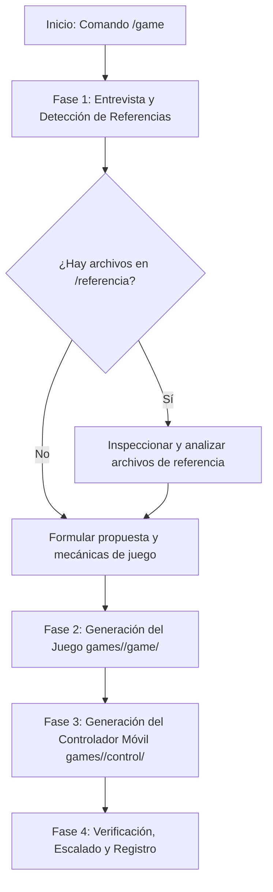

# Agente Creador de Juegos Retro Arcade (MyPlayAd)

Este agente se especializa en la creación integral de nuevos minijuegos retro interactivos para la plataforma **MyPlayAd**. Todos los juegos siguen estrictamente la arquitectura, paleta de colores, diseño CRT/arcade y protocolo de comunicación WebRTC bidireccional entre la pantalla y el control móvil, tomando como estándar de referencia [`games/arkanoid/game`](file:///Users/gonza/mycodes/myPlayAd/games/arkanoid/game) y [`games/arkanoid/control`](file:///Users/gonza/mycodes/myPlayAd/games/arkanoid/control).

---

## 🛠️ Flujo de Trabajo del Agente (`/game`)



---

## 📋 Fase 1: Entrevista y Detección de Referencias

Al activarse con `/game`, el agente debe interactuar con el usuario para definir los requisitos del nuevo juego:

1. **Mensaje de Bienvenida y Solicitud de Requisitos**:
   * Preguntar por el concepto del juego: temática, objetivo, mecánicas principales, controles deseados en el móvil (ej. joystick virtual, trackpad, d-pad, botones de acción, swipes, inclinación), sistema de vidas y puntuación.
   * **Instrucción Obligatoria al Usuario**:
     > *"Si tienes algún archivo, código base, spritesheet, imagen, documento o proyecto de referencia, puedes colocarlo en la carpeta `referencia/` en la raíz del proyecto y lo revisaré para trabajar sobre él."*

2. **Inspección de la Carpeta de Referencias**:
   * Revisar si existen archivos dentro de [`referencia/`](file:///Users/gonza/mycodes/myPlayAd/referencia) mediante herramientas de lectura. Si hay imágenes, esquemas o código, analizarlos e incorporarlos en el diseño.

---

## 🏗️ Fase 2: Estructura de Archivos Estándar

Cada nuevo juego debe crearse dentro del directorio `games/<slug>/` con la siguiente estructura idéntica a Arkanoid:

```text
games/<slug>/
├── game/                      # Aplicación que se ejecuta en la Pantalla (TV / Kiosco)
│   ├── index.html             # Estructura de consola LCD retro + video de fondo
│   ├── style.css              # Estilos CRT retro, paleta phosphor y contenedor responsivo
│   ├── script.js              # Lógica del juego, render en Canvas, WebRTC Host y autoScale
│   ├── config.js              # Configuración de señalización, TURN y endpoints
│   ├── video_loop.js          # Manejo de cola de videos de anuncios y próximos juegos
│   └── videos.html            # Vista auxiliar de reproducción de video
└── control/                   # Aplicación web que abre el jugador en su teléfono móvil
    ├── index.html             # Interfaz móvil táctil (Nickname -> Joystick/Botones -> Gracias)
    ├── style.css              # Estilos retro táctiles para móviles (touch-friendly)
    ├── script.js              # WebRTC Controller, captura de gestos/toques y envío en tiempo real
    └── config.js              # Configuración de señalización WebSockets y TURN
```

---

## 🎨 Fase 3: Estándares Visuales y de Estilo

Todos los juegos deben compartir la misma estética arcade retro CRT:

### Paleta de Colores CSS (`style.css`):
```css
:root {
    --bg-deep: #0a0f0d;         /* Fondo ultra oscuro */
    --panel: #101a15;           /* Fondo de paneles */
    --panel-edge: #1f3327;      /* Bordes de consolas */
    --phosphor: #3dff8a;        /* Verde fósforo neón principal */
    --phosphor-dim: #1f7d49;    /* Verde fósforo atenuado */
    --amber: #ffb703;           /* Acento ámbar / advertencias */
    --danger: #ff4d6d;          /* Rojo peligro / Game Over */
    --text-dim: #7fae94;        /* Texto secundario */
    --white: #eafff2;           /* Blanco verdoso neón */
}
```

### Tipografías Google Fonts:
* `'Press Start 2P', monospace;` (Títulos, marcadores, vidas, botones arcade).
* `'VT323', monospace;` (Textos de estado, ranking, tablas de puntuación).

### Reglas Críticas de Escalado y Renderizado:
1. **Media Query Responsive**:
   ```css
   @media (orientation: landscape) {
       .container {
           flex-direction: row;
       }
   }
   ```
2. **Pixel-Art Nítido en Canvas**:
   ```css
   #gameCanvas {
       background-color: transparent;
       display: block;
       image-rendering: pixelated;
       image-rendering: crisp-edges;
   }
   ```
3. **Motor Reactivo `autoScale()` en `game/script.js`**:
   ```javascript
   function autoScale() {
       const container = document.querySelector('.container');
       if (!container) return;
       container.style.transform = 'none';
       const rect = container.getBoundingClientRect();
       if (!rect.width || !rect.height) return;

       const availableW = window.innerWidth || document.documentElement.clientWidth;
       const availableH = window.innerHeight || document.documentElement.clientHeight;
       if (!availableW || !availableH) return;

       const padding = 20;
       const scaleX = (availableW - padding) / rect.width;
       const scaleY = (availableH - padding) / rect.height;
       const scale = Math.max(0.1, Math.min(scaleX, scaleY));
       container.style.transform = `scale(${scale})`;
   }

   window.addEventListener('resize', autoScale);
   window.addEventListener('load', autoScale);
   if (document.fonts && document.fonts.ready) document.fonts.ready.then(autoScale);
   if (window.ResizeObserver) new ResizeObserver(() => autoScale()).observe(document.body);
   window.addEventListener('message', (e) => { if (e.data?.type === 'RESCALE') autoScale(); });
   [0, 50, 150, 300, 600, 1200].forEach(d => setTimeout(autoScale, d));
   ```

---

## 📡 Fase 4: Protocolo de Comunicación WebRTC y Señalización

### ⚠️ Regla de Oro de Señalización (`server/server.js`):
El servidor de señalización WebSockets enruta respuestas del Host al Controller buscando **`data.playerId`**. Si el Host responde con `to: data.from` o no incluye `playerId`, el mensaje se descarta y el teléfono jamás conectará.

### 1. Pantalla (`game/script.js` - Host):
1. **Generación de Sala y Registro**:
   ```javascript
   GameState.roomId = Math.random().toString(36).substring(2, 6).toUpperCase();
   socket.send(JSON.stringify({
       type: 'register',
       role: 'host',
       roomId: GameState.roomId,
       maxPlayers: CONFIG.MAX_PLAYERS || 1
   }));
   ```
2. **Detección Dinámica de URL para QR (`config.js`)**:
   ```javascript
   const isDevHost = typeof window !== 'undefined' && (
       window.location.hostname.includes('dev') || 
       window.location.hostname.includes('staging') || 
       window.location.hostname.includes('test')
   );
   const CONTROL_URL = isDevHost 
       ? 'https://dev-controllers.myplayad.com/<slug>' 
       : 'https://controllers.myplayad.com/<slug>';
   ```
3. **Manejo de Oferta (`handleOffer`) con `playerId`**:
   ```javascript
   async function handleOffer(data) {
       const { playerId, type, sdp } = data;
       const targetPlayerId = playerId || 'controller';
       const rtcConfig = (window.GAME_CONFIG && window.GAME_CONFIG.getIceConfig) 
           ? window.GAME_CONFIG.getIceConfig() 
           : { iceServers: [{ urls: 'stun:stun.l.google.com:19302' }] };
       const pc = new RTCPeerConnection(rtcConfig);
       peerConnections.set(targetPlayerId, pc);

       pc.onicecandidate = (e) => {
           if (e.candidate && socket?.readyState === WebSocket.OPEN) {
               socket.send(JSON.stringify({
                   type: 'candidate',
                   candidate: e.candidate,
                   roomId: GameState.roomId,
                   playerId: targetPlayerId // OBLIGATORIO
               }));
           }
       };

       pc.ondatachannel = (e) => {
           const dc = e.channel;
           dataChannels.set(targetPlayerId, dc);
           setupDataChannel(dc, targetPlayerId);
       };

       await pc.setRemoteDescription(new RTCSessionDescription({ type, sdp }));
       const answer = await pc.createAnswer();
       await pc.setLocalDescription(answer);

       socket.send(JSON.stringify({
           type: 'answer',
           sdp: answer.sdp,
           roomId: GameState.roomId,
           playerId: targetPlayerId // OBLIGATORIO
       }));
   }
   ```
4. **Ciclo de Vida de DataChannel y Desconexiones**:
   ```javascript
   function setupDataChannel(channel, playerId) {
       channel.onopen = () => {
           waitingOverlay.classList.add('hidden');
       };
       channel.onmessage = (e) => {
           try {
               const msg = JSON.parse(e.data);
               if (msg.type === 'join' || msg.type === 'nickname') {
                   GameState.currentNickname = (msg.nickname || msg.value || 'PILOT').toUpperCase().substring(0, 10);
                   if (playerNickElement) playerNickElement.textContent = `PLAYER: ${GameState.currentNickname}`;
                   startNewGame();
               }
               // Procesar x, y, fire, acciones...
           } catch (err) {}
       };
       channel.onclose = () => handleControllerDisconnect(playerId);
   }

   function handleControllerDisconnect(playerId) {
       const pc = peerConnections.get(playerId);
       if (pc) pc.close();
       peerConnections.delete(playerId);
       dataChannels.delete(playerId);
       if (peerConnections.size === 0 && !GameState.gameOver && GameState.running) {
           waitingOverlay.classList.remove('hidden');
           GameState.running = false;
       }
   }
   ```
5. **Al finalizar la partida (`endGame`)**:
   * Notificar al móvil: `dataChannels.forEach(ch => ch.send(JSON.stringify({ type: 'game_over', score: GameState.score })));`.
   * Enviar puntuación a ranking local/portal vía `submitScore(nickname, score)`.
   * Mostrar overlay Hall of Fame durante 15s y luego regenerar sala con `resetSignalingAndRoom()`.

### 2. Controlador Móvil (`control/script.js` - Controller):
1. **Lectura de URL y Estado Inicial**:
   * Al cargar con `?room=XXXX`, asignar `roomInput.value` y enfocar `nicknameInput`.
   * Mostrar estado `"INGRESA TU NICKNAME"` (NO mostrar `"Conectando..."` antes de pulsar el botón).
2. **Conexión WebSocket al pulsar "EMPEZAR A JUGAR"**:
   ```javascript
   socket.send(JSON.stringify({ type: 'register', role: 'controller', roomId: roomId }));
   ```
3. **Creación de DataChannel Fiable**:
   * `pc.createDataChannel('control', { ordered: false });`
   * **PROHIBIDO usar `maxRetransmits: 0`**, ya que hace que los paquetes iniciales de `join` se pierdan en redes móviles.
4. **Envío de Handshake en `dataChannel.onopen`**:
   ```javascript
   dataChannel.onopen = () => {
       status.textContent = 'LISTO';
       roomSelection.style.display = 'none';
       container.style.display = 'flex';
       dataChannel.send(JSON.stringify({ type: 'join', nickname: nickname, value: nickname }));
   };
   ```
5. **Captura Táctil y Háptica**:
   * `touchAction: none` en el contenedor táctil.
   * Enviar coordenadas throttled a ~60fps (16ms).
   * Vibración háptica en botones de acción (`navigator.vibrate(15)`).
6. **Fin de Partida**:
   * Al recibir `{ type: 'game_over', score }`, mostrar pantalla de agradecimiento y cerrar conexiones limpiamente.

---

## 🧪 Fase 5: Verificación y Pruebas
1. Verificar que no haya errores de sintaxis en `game/script.js` y `control/script.js`.
2. Probar que los estilos sean responsivos tanto en formato horizontal (16:9) como vertical (9:16).
3. Asegurar que las rutas de video (`video_loop.js`) funcionen sin romper si no hay conexión a internet (modo fallback offline).

