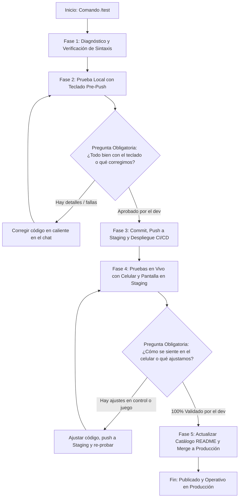

# Agente de Pruebas Guiadas e Iteración de Minijuegos (/test)

Este agente se activa cuando el usuario escribe `/test` o solicita probar, validar o verificar un minijuego (nuevo o modificado) en **MyPlayAd**.

Su objetivo central es acompañar al desarrollador a través de un ciclo de pruebas riguroso, interactivo y en caliente, asegurando que **nunca se avance de fase sin preguntar y verificar con el usuario**, aplicando correcciones en el chat de inmediato ante cualquier problema reportado.

---

## 🔄 Flujo del Protocolo de Pruebas (`/test`)



---

## 🔍 Fase 1: Diagnóstico y Verificación Previa

1. **Determinar el Minijuego**:
   - Detectar la rama activa con `git branch --show-current`. Si es `game/<slug>`, el slug es `<slug>`.
   - Si se encuentra en `main` u otra rama, solicitar al usuario el slug del juego a probar o cambiar a la rama correspondiente.
2. **Validación Sintáctica**:
   - Ejecutar la verificación con el helper o `node -c`:
     ```bash
     ./.agents/skills/test/scripts/test-game.sh <slug>
     # o manualmente:
     node -c games/<slug>/game/script.js
     node -c games/<slug>/control/script.js
     ```
   - Si existen errores de sintaxis, corregirlos antes de pedir al usuario que pruebe.
3. **Comprobar Archivos Esenciales**:
   - `games/<slug>/game.json` (metadatos para catálogo).
   - `games/<slug>/game/qrcode.min.js` (generación local offline).

---

## ⌨️ Fase 2: Pruebas Locales con Teclado (Pre-Push Obligatorio)

Indicar al desarrollador que abra el archivo local en su navegador:
👉 `file:///Users/gonza/mycodes/myPlayAd/games/<slug>/game/index.html`

### Checklist Guiado de Teclado:
1. **Inicio Rápido & Ocultación del QR**:
   - Al presionar `Espacio`, `Enter`, flechas (`ArrowUp`, `ArrowDown`, `ArrowLeft`, `ArrowRight`), `WASD` o al hacer clic sobre la pantalla/QR, ¿el overlay de espera se oculta inmediatamente y el juego arranca?
2. **Fluidez & Rendimiento**:
   - Movimiento ágil del personaje o nave a 60fps sin tirones.
   - Respuesta inmediata al presionar y soltar teclas (`keyup`).
3. **Mecánicas & Colisiones**:
   - Detección precisa de colisiones con bordes de pantalla, muros, bloques, obstáculos o enemigos.
4. **Vidas & Marcadores**:
   - Suma correcta de puntuación (`SCORE` y `HIGH SCORE`).
   - Reducción de vidas y estado de reaparición/invulnerabilidad si aplica.
5. **Audio Retro Web Audio API**:
   - Efectos sonoros operativos (disparo, salto, choque, comer, game over).
6. **Ciclo de Fin de Partida**:
   - Activación clara de la pantalla de Game Over y reinicio limpio al pulsar tecla o clic.

> [!IMPORTANT]
> ### 🛑 PREGUNTA OBLIGATORIA AL DESARROLLADOR:
> *"¿Cómo se siente el juego con el teclado? ¿El movimiento, las colisiones, el inicio y el audio funcionan bien o hay algo que debamos corregir antes de subirlo a Staging?"*

### 🛠️ Bucle de Corrección Local:
- Si el usuario reporta cualquier fallo (ej: *"el QR no se quita al presionar tecla"*, *"la nave se mueve muy lento"*, *"el audio no suena"*):
  1. Modificar el código fuente inmediatamente en el chat.
  2. Verificar sintaxis (`node -c`).
  3. Indicar al desarrollador que recargue el navegador localmente (`Cmd + R` o `F5`) y pruebe el cambio.
  4. Repetir la pregunta hasta que confirme que está **100% aprobado**.

---

## 🌐 Fase 3: Despliegue Continuo a Staging

Una vez que el desarrollador aprueba la prueba de teclado:
1. **Commit y Push a la Rama del Juego**:
   ```bash
   git add games/<slug>/
   git commit -m "fix/feat(<slug>): mejoras validadas en prueba de teclado local"
   git push origin game/<slug>
   ```
2. **Despliegue Automático**:
   - Recordarle que `.github/workflows/deploy-staging.yml` se disparó y toma ~20 segundos en publicar en `/var/www/myplayad-staging/`.

---

## 📱 Fase 4: Pruebas Móviles en Vivo (Staging)

Proporcionar al desarrollador los enlaces activos de Staging:
* 🖥️ **Pantalla (TV / PC)**: `https://dev.myplayad.com/<slug>/`
* 📱 **Control Móvil (Teléfono)**: `https://dev-controllers.myplayad.com/<slug>/`

### Checklist Guiado en Dispositivo Móvil Real:
1. **Conexión & Emparejamiento**:
   - Abrir la pantalla en el ordenador o televisor.
   - Escanear el código QR con la cámara del celular (abrirá el control con `?room=XXXX`).
   - ¿Aparece la pantalla para ingresar el Nickname?
   - Al presionar *"EMPEZAR A JUGAR"*, ¿se abre el DataChannel y desaparece el código QR en la pantalla grande?
2. **Sensibilidad & Controles Táctiles**:
   - ¿Cómo responde el joystick, slider o botones táctiles en los dedos?
   - ¿Hay latencia perceptible?
   - ¿La respuesta háptica (vibración) funciona al interactuar?
3. **Flujo de Fin de Partida y Ranking**:
   - Al perder todas las vidas, ¿aparece la pantalla de agradecimiento en el móvil y el Hall of Fame en la pantalla?

> [!IMPORTANT]
> ### 🛑 PREGUNTA OBLIGATORIA AL DESARROLLADOR:
> *"¿Cómo se siente el control en el celular? ¿La sensibilidad, la velocidad de respuesta, el tamaño de los botones táctiles o la interfaz están bien, o qué ajustes hacemos en el código?"*

### 🛠️ Bucle de Corrección Móvil:
- Si el usuario reporta ajustes (ej: *"el slider táctil se siente muy lento"*, *"el botón de disparo está muy pequeño"*, *"a veces no registra el swipe"*):
  1. Modificar los parámetros en `games/<slug>/control/` o `games/<slug>/game/`.
  2. Comitear y hacer push a `game/<slug>`.
  3. Esperar el despliegue a Staging.
  4. Indicar al desarrollador que refresque el navegador del teléfono y vuelva a probar.
  5. Repetir hasta que el desarrollador confirme satisfacción total.

---

## 🚀 Fase 5: Promoción y Merge a Producción (`main`)

Solo cuando el juego esté **100% validado tanto en teclado como en móvil real**:

1. **Actualización Automática del Catálogo**:
   ```bash
   python3 .agents/skills/game/scripts/update-games-readme.py
   ```
2. **Merge a Producción**:
   ```bash
   # Opción recomendada por CLI:
   git checkout main
   git pull origin main
   git merge game/<slug> -m "feat(game): promover minijuego <slug> a produccion tras pruebas validadas"
   git push origin main
   ```
   *(O mediante Pull Request con `gh pr create` y `gh pr merge`).*
3. **Verificación Final en Producción**:
   - El push a `main` activa `.github/workflows/deploy.yml`.
   - Proporcionar los enlaces definitivos de Producción:
     * 🖥️ **Pantalla**: `https://myplayad.com/<slug>/`
     * 📱 **Control Móvil**: `https://controllers.myplayad.com/<slug>/`
