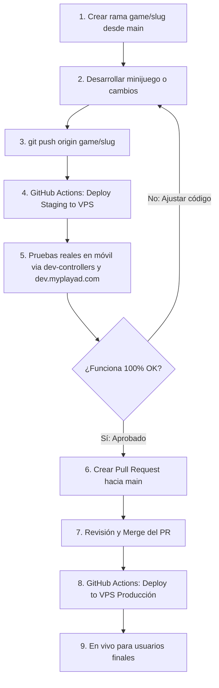

# MyPlayAd - Interactive Digital Signage & Retro Games

Este repositorio contiene el código fuente completo del sistema MyPlayAd, una plataforma de publicidad interactiva y cartelería digital (Digital Signage) que combina reproducción de videos con minijuegos retro (Arkanoid, Galaga, Space Invaders, OutRun, Snake) controlados en tiempo real desde los teléfonos de los usuarios.

## Arquitectura del Proyecto

El proyecto está dividido en tres componentes principales:

1. **`portal/` (Next.js):** El panel de administración web y la API pública. Maneja la programación de campañas, gestión de pantallas y proporciona los endpoints que consumen las pantallas.
2. **`screen/` (Node.js + HTML/JS):** El servidor local y frontend que corre físicamente en cada pantalla (ej. Raspberry Pi). Sincroniza y almacena en caché los videos localmente para evitar cortes de internet, y reproduce el bucle publicitario.
3. **`games/` (Static HTML/JS):** Los juegos retro interactivos. Tienen dos vistas: la del juego (que carga la pantalla) y el control (que carga el usuario en su móvil escaneando un código QR).

---
## 🕹️ Catálogo de Minijuegos Disponibles en Producción

<!-- GAMES_CATALOG_START -->
Actualmente la rama principal (`main`) cuenta con **5 minijuegos** interactivos adaptados al estándar **Pure Arcade** (pantalla completa, gabinete centrado, bezel de 440px y QR local offline):

| Juego | Género | Mecánica & Descripción | Controles Móviles / Teclado | Producción | Staging (Dev) |
| :--- | :--- | :--- | :--- | :--- | :--- |
| **🧱 Arkanoid**<br>`arkanoid` | Breakout / Arcade | Clásico rompe-bloques con paleta deflectora, física de rebote balístico y potenciadores. | Deslizador táctil horizontal / Flechas y teclas A-D | 🖥️ [Pantalla](https://myplayad.com/arkanoid/)<br>📱 [Control](https://controllers.myplayad.com/arkanoid/) | 🖥️ [Pantalla](https://dev.myplayad.com/arkanoid/)<br>📱 [Control](https://dev-controllers.myplayad.com/arkanoid/) |
| **🚀 Galaga**<br>`galaga` | Space Shooter | Shooter espacial clásico contra escuadrones de insectoides alienígenas en formación dinámica. | Deslizador horizontal y botón de disparo táctil / Flechas y Espacio | 🖥️ [Pantalla](https://myplayad.com/galaga/)<br>📱 [Control](https://controllers.myplayad.com/galaga/) | 🖥️ [Pantalla](https://dev.myplayad.com/galaga/)<br>📱 [Control](https://dev-controllers.myplayad.com/galaga/) |
| **👾 Space Invaders**<br>`invaders` | Fixed Shooter | Defensa de la Tierra contra oleadas alienígenas descendentes con búnkeres de protección destructibles. | Botones de dirección y disparo láser táctil / Flechas y Espacio | 🖥️ [Pantalla](https://myplayad.com/invaders/)<br>📱 [Control](https://controllers.myplayad.com/invaders/) | 🖥️ [Pantalla](https://dev.myplayad.com/invaders/)<br>📱 [Control](https://dev-controllers.myplayad.com/invaders/) |
| **🏎️ OutRun**<br>`outrun` | Arcade Racing | Carrera retro a alta velocidad con bifurcaciones de ruta hacia 5 metas distintas (A-E) y reloj contrarreloj. | Volante digital, acelerador y freno táctil / Flechas o WASD | 🖥️ [Pantalla](https://myplayad.com/outrun/)<br>📱 [Control](https://controllers.myplayad.com/outrun/) | 🖥️ [Pantalla](https://dev.myplayad.com/outrun/)<br>📱 [Control](https://dev-controllers.myplayad.com/outrun/) |
| **🐍 Snake**<br>`snake` | Arcade Retro | La serpiente retro clásica que crece al devorar píldoras, evitando colisiones con bordes y su propio cuerpo. | D-Pad direccional y gestos táctiles de deslizamiento (Swipe) / Flechas del teclado | 🖥️ [Pantalla](https://myplayad.com/snake/)<br>📱 [Control](https://controllers.myplayad.com/snake/) | 🖥️ [Pantalla](https://dev.myplayad.com/snake/)<br>📱 [Control](https://dev-controllers.myplayad.com/snake/) |
<!-- GAMES_CATALOG_END -->


## 🚀 Flujo de Ramas y CI/CD (Staging -> Producción)

El repositorio cuenta con un ciclo de despliegue continuo (CI/CD) automatizado con GitHub Actions sobre el VPS de Hostinger, separando estrictamente el entorno de pruebas (**Staging**) del entorno real (**Producción**).

### 🌐 Entornos y Dominios

| Entorno | Rama Git | Desencadenador CI/CD | Directorio VPS | URLs de Acceso |
| :--- | :--- | :--- | :--- | :--- |
| **Staging** (Pruebas) | `game/**`, `staging` | Push a la rama (`deploy-staging.yml`) | `/var/www/myplayad-staging/` | 🖥️ Pantallas: `https://dev.myplayad.com/<slug>/`<br>📱 Controles: `https://dev-controllers.myplayad.com/<slug>/` |
| **Producción** | `main` | Push o Merge a `main` (`deploy.yml`) | `/var/www/myplayad/` (frontend)<br>`/opt/myplayad/` (backend) | 🖥️ Pantallas: `https://myplayad.com`<br>📱 Controles: `https://controllers.myplayad.com/<slug>/` |

### 🔄 Diagrama del Ciclo de Vida



### 📋 Guía Paso a Paso para Nuevos Juegos (`/game` y `/test`)

> [!TIP]
> Puedes usar el comando **/game** para crear nuevos juegos siguiendo el estándar Pure Arcade, y el comando **/test** para ejecutar el protocolo guiado de pruebas (teclado -> celular en Staging -> merge con bucle interactivo de corrección en el chat).

> [!IMPORTANT]
> **PROHIBIDO desarrollar o commitear juegos directamente en `main`.**
> Commitear en `main` dispara el despliegue directo a los kioscos de producción. Sigue siempre este flujo:

1. **Crear y pasarse a la rama aislada del juego**:
   ```bash
   # Opción recomendada (script automatizado):
   ./.agents/skills/game/scripts/start-game-branch.sh <slug>

   # Opción manual:
   git checkout main && git pull origin main
   git checkout -b game/<slug>
   ```

2. **Desarrollar el Minijuego y Soporte de Teclado**:
   - Implementar la pantalla en `games/<slug>/game/` y el control móvil en `games/<slug>/control/`.
   - Incluir soporte completo de teclado (`ArrowLeft`, `ArrowRight`, `ArrowUp`, `ArrowDown`, `WASD`, `Espacio`, `Enter`) en `game/script.js`.

3. **Probar primero localmente con Teclado (Pre-Push)**:
   - **ANTES** de hacer commit o push, abre `games/<slug>/game/index.html` en tu navegador.
   - Haz clic en la pantalla o pulsa `Espacio`/`Enter` para saltar el QR e iniciar la partida de prueba.
   - Juega 1-2 minutos con el teclado para verificar fluidez a 60fps, detección de colisiones, velocidad de respuesta, puntuación y reinicio.

4. **Subir a Staging para Prueba Móvil**:
   ```bash
   git add games/<slug>/
   git commit -m "feat(game): implementar minijuego <slug>"
   git push origin game/<slug>
   ```
   *El workflow `.github/workflows/deploy-staging.yml` desplegará los cambios en ~20 segundos en `/var/www/myplayad-staging/`.*

5. **Probar en Dispositivos Reales (Staging)**:
   - Abre la pantalla en el navegador: `https://dev.myplayad.com/<slug>/`
   - Escanea el código QR con tu móvil: abrirá `https://dev-controllers.myplayad.com/<slug>/?room=XXXX`
   - Prueba WebRTC, latencia, respuesta táctil, vidas, ranking y reinicio.

6. **Crear Pull Request (PR)**:
   Una vez probado y validado:
   ```bash
   # Opción recomendada:
   ./.agents/skills/game/scripts/promote-to-main.sh <slug>

   # Opción manual:
   gh pr create --base main --head game/<slug> \
       --title "feat(game): agregar minijuego <slug>" \
       --body "Minijuego probado y verificado en Staging."
   ```

7. **Merge y Despliegue en Producción**:
   - Aprueba y mergea el PR (desde la interfaz de GitHub o mediante CLI):
     ```bash
     gh pr merge <PR_URL> --merge --delete-branch
     ```
   - Al mergear en `main`, el workflow `.github/workflows/deploy.yml` actualiza automáticamente el catálogo de juegos en este `README.md` y publica los juegos en producción.
   - Sincroniza tu entorno local:
     ```bash
     git checkout main && git pull origin main
     ```
   - *(Opcional)* Si realizas el merge manualmente en local por CLI:
     ```bash
     python3 .agents/skills/game/scripts/update-games-readme.py
     ```

---

## 🛠️ Cómo Correr el Proyecto Localmente (Desarrollo)

Para probar el proyecto en tu computadora, necesitas tener instalado **Node.js** y **Git**. 

### 1. Iniciar el Portal (Backend/Admin)
El portal provee la API necesaria para que las pantallas sepan qué reproducir.

```bash
cd portal
npm install
npm run dev
```
El portal estará corriendo en `http://localhost:3000`.

### 2. Iniciar el Servidor de Pantalla (Screen Server)
Este es el servidor que corre en la máquina física conectada al televisor (o en tu computador para pruebas). Se encarga de descargar los videos y levantar el reproductor.

Abre una **nueva pestaña** en tu terminal:

```bash
cd screen
npm install

# Inicia el servidor pasando el ID de la pantalla y la URL base de los videos
SCREEN_ID=bc502bba-859c-461c-a795-f6e4bf2d4931 REMOTE_VIDEO_SERVER_URL=https://videos.myplayad.com node server.js
```
*Nota: Reemplaza el `SCREEN_ID` por un ID válido de tu base de datos si estás probando una pantalla específica.*

El servidor local de pantalla estará corriendo en `http://localhost:8090`.

### 3. Probar la Pantalla
Abre tu navegador (Chrome recomendado) e ingresa a:
👉 `http://localhost:8090`

Verás la interfaz de la pantalla principal reproduciendo videos y cambiando a juegos según la programación.

---

## 🎮 Pruebas de Juegos y Controladores

Cuando la pantalla muestre un juego (ej. Snake), aparecerá un **Código QR**. 
1. Escanea el código QR con tu teléfono o copia el enlace.
2. El enlace abrirá la vista del controlador (Joystick/Trackpad) del juego en tu navegador web móvil.
3. Ingresa tu Nickname y la comunicación en tiempo real (vía WebSockets/MQTT) conectará tu teléfono con el juego en la pantalla.

---

## 🍓 Configuración para Raspberry Pi (Producción)

Para desplegar este sistema en un televisor real usando una Raspberry Pi, debes configurar el dispositivo en **Modo Kiosco** para que inicie automáticamente el servidor Node y el navegador Chromium a pantalla completa sin intervención humana.

### Requisitos Previos en la Raspberry Pi
1. Instalar Raspberry Pi OS (versión con escritorio ligero).
2. Instalar Node.js (versión 18+).
3. Instalar PM2 para manejar los procesos en segundo plano:
   ```bash
   sudo npm install -g pm2
   ```

### 1. Clonar y Configurar
Clona este repositorio en la Raspberry Pi e instala las dependencias de la carpeta `/screen`.

### 2. Iniciar el Servidor con PM2
Queremos que el `server.js` corra siempre de fondo y se reinicie si falla o si se reinicia la Raspberry.

```bash
cd /ruta/a/myPlayAd/screen

# Crear un archivo de entorno o pasar las variables directamente
pm2 start server.js --name "myplayad-screen" --env SCREEN_ID="TU_SCREEN_ID" --env REMOTE_VIDEO_SERVER_URL="https://videos.myplayad.com"

# Guardar la configuración para que arranque al inicio del sistema
pm2 save
pm2 startup
```

### 3. Configurar Chromium en Modo Kiosco (Autostart)
Necesitamos que Chromium se abra automáticamente en pantalla completa al encender la Raspberry y apunte a `localhost:8090`.

Edita el archivo de autostart de LXDE:
```bash
sudo nano /etc/xdg/lxsession/LXDE-pi/autostart
```

Agrega o reemplaza el contenido por lo siguiente:
```text
@lxpanel --profile LXDE-pi
@pcmanfm --desktop --profile LXDE-pi
@xset s off
@xset -dpms
@xset s noblank
@chromium-browser --noerrdialogs --disable-infobars --kiosk --autoplay-policy=no-user-gesture-required http://localhost:8090
```
* **Explicación de las flags:**
  * `@xset ...`: Desactiva el protector de pantalla y el apagado del monitor.
  * `--kiosk`: Fuerza a Chromium a abrirse en pantalla completa, sin pestañas ni botones.
  * `--autoplay-policy=no-user-gesture-required`: **CRÍTICO**. Permite que Chromium reproduzca los videos automáticamente sin requerir que un usuario haga clic en la pantalla, evitando los bloqueos de seguridad de auto-reproducción.

### 4. Ocultar el cursor del mouse (Opcional pero recomendado)
Instala `unclutter` para ocultar el cursor del mouse cuando no se mueve:
```bash
sudo apt-get install unclutter
```
Añade `@unclutter -idle 0.1 -root` al archivo `autostart` mencionado en el paso anterior.

---

## 🔒 Notas sobre CORS y Seguridad (Mixed Content)
El sistema utiliza una inyección binaria de videos vía `postMessage` para evadir bloqueos de seguridad en navegadores modernos (Chrome Private Network Access y Safari Mixed Content). Esto asegura que los iframes de los juegos que corren bajo `https://` puedan acceder fluidamente a los videos descargados en la red local (`http://localhost`) sin interrupciones. No se requieren configuraciones SSL/TLS en la Raspberry Pi.
